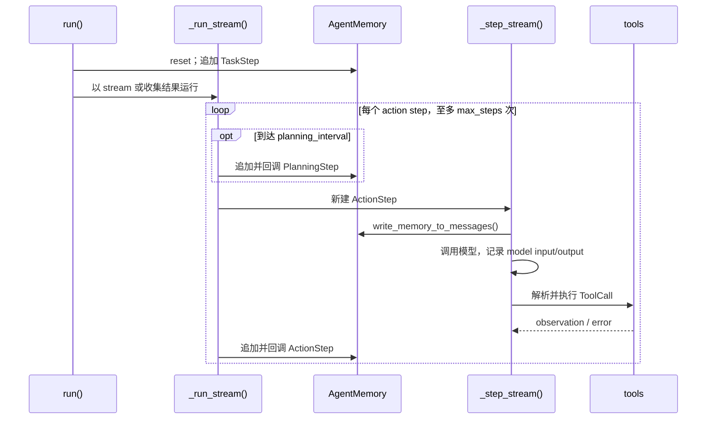

# 第 3 天：smolagents 作为 AgentLoop 的参考实现

这节不研究怎样初始化 `ToolCallingAgent`，而是用它回答一个设计问题：一个可靠的 tool-loop 应该把哪些东西做成一等对象？

当前参考的是 Hugging Face `smolagents` 的 `main` 分支：[`agents.py`](https://github.com/huggingface/smolagents/blob/main/src/smolagents/agents.py) 与 [`memory.py`](https://github.com/huggingface/smolagents/blob/main/src/smolagents/memory.py)。官方的 [agents reference](https://huggingface.co/docs/smolagents/reference/agents) 也明确说明：所有 agent 都继承 `MultiStepAgent`，按 ReAct 的 action → observation 循环工作。

## 先给对照答案

| 我的最小实现 | smolagents | 关键差别 |
| --- | --- | --- |
| `AgentState` | `AgentMemory` | 你的对象只存 task 与成功的历史；它的 memory 还存 system prompt、task、planning、每次 action 的完整记录。 |
| `Step` | `ActionStep` | 一个 `ActionStep` 对应一次模型调用，可以含多个 `ToolCall`；它不是“一次工具调用”。 |
| `build_messages(state)` | `write_memory_to_messages()` | 两者都把历史投影为模型消息；前者直接读取专用 `history`，后者让每个 memory step 自己转换为消息。 |
| `tools.execute(...)` | `process_tool_calls()` → `execute_tool_call()` | 后者先记录 call，再执行，并把 observation 或错误写回同一个 `ActionStep`。 |
| `AgentLoop.run()` 中的 `for` | `run()` → `_run_stream()` | `run()` 初始化一次任务；`_run_stream()` 创建、调度和落盘每个 step；`_step_stream()` 是子类实现的单步动作。 |

这里最容易混淆的是 smolagents 的 `state`。它是 agent 可供工具和后续调用引用的额外运行变量；**可回放的对话/行动历史在 `memory`，不在 `state`**。所以你的 `AgentState` 在语义上更接近 `AgentMemory`，而不是 smolagents 的 `state` 字段。

## 从 `run()` 开始读

`MultiStepAgent.run()` 是一次任务的外壳，而不是 loop 本身。它做五件事：

1. 选本次 `max_steps`，记录 task，并按 `reset` 决定是否清空旧 memory。
2. 把 task 写成 `TaskStep`，因此 task 也成为可回放历史的一部分。
3. 把额外输入写入 agent 的 `state`；这是工具执行时可引用的数据，不是聊天记录。
4. 进入 `_run_stream()`；若 `stream=False`，就收集它产生的 step，最后取 `FinalAnswerStep.output`。
5. 可选地汇总所有 `ActionStep` / `PlanningStep` 的 token usage，返回完整 `RunResult`。

你的 `run()` 已经具备最小版本的第 1、4 件事：建 `AgentState`，然后有界地反复调用模型和工具。它尚未把 task、模型输入、模型输出、时间、错误等都变成历史的一部分，因此当前只能打印调试信息，不能在运行后可靠地 replay。

## `_run_stream()`：真正的 loop owner

它从 `step_number = 1` 开始，在未拿到 final answer 且未超过 `max_steps` 时循环。每轮先按需插入 planning，再创建一个空的 `ActionStep`，交给 `_step_stream(action_step)` 填充。无论本轮成功还是失败，`finally` 都会完成该 step、运行 callback、追加到 `memory.steps`，然后递增计数。

`max_steps` 计数的是 **action step / 模型决策轮数**，不计插入的 `PlanningStep`。达到上限后框架不会把“没有工具调用”误当作成功，而会走 `provide_final_answer(task)`，把这个上限事件也记录为带 `AgentMaxStepsError` 的 action step。

这正是你当前实现和参考实现最实用的差异：你的上限直接抛 `RuntimeError`；smolagents 把上限看作一次已记录的控制流结果，再尝试根据已有轨迹生成最终答复。

## `_step_stream()`：单步协议由子类实现

`MultiStepAgent._step_stream()` 是抽象方法。`ToolCallingAgent` 的实现顺序是：

1. 调用 `write_memory_to_messages()`，并把结果保存到 `ActionStep.model_input_messages`。
2. 调用模型，保存 `model_output_message`、`model_output` 与 token usage。
3. 解析模型原生 tool calls；每个 call 转为 `memory.ToolCall(name, arguments, id)`。
4. `process_tool_calls()` 执行工具，把 calls 和 observations 回写到 **同一个** `ActionStep`。
5. 以 `ActionOutput` 表明这一轮是否通过内置 `final_answer` 工具结束。

因此 `_step_stream()` 的职责不是“遍历多步”，而是定义一次 ReAct 原子操作如何发生。`CodeAgent` 可以替换这一层，以 Python code 调用工具；`ToolCallingAgent` 则使用 JSON/模型原生 function calling。外层 loop 和 memory 合同保持不变。

你的 `for call in response.tool_calls` 同时承担了第 3、4 步。它对这个练习完全够用；要向 smolagents 靠近，第一步不是复制其并发或异常包装，而是让“本次模型调用”的 `ActionStep` 先存在，再把 model input、response、calls、observations 填进去，最后统一追加到历史。

## `write_memory_to_messages()`：memory 是 source of truth

实现只有两层：先把 `memory.system_prompt` 转消息，再依次调用每个 step 的 `to_messages()`。复杂性不在函数体，而在每种 step 的投影合同：

| memory step | 送回模型的内容 |
| --- | --- |
| `SystemPromptStep` | system prompt |
| `TaskStep` | `New task: ...`，以及可选图片 |
| `PlanningStep` | plan，随后一条“继续执行 plan”的 user message |
| `ActionStep` | 模型文字输出、tool calls、工具 observation，或可供下一轮纠错的 error |

你的 `build_messages()` 已经抓住了核心：每一轮把以前的 assistant tool call 和 tool response 重放给模型。它的边界更窄：没有 system prompt、planning 或错误的表示。不要把它理解成“拼 prompt 的辅助函数”；它是把运行事实翻译成下轮模型上下文的边界。

## `PlanningStep` 与 `planning_interval`

设置 `planning_interval` 后，第 1 个 action step 前一定会产生 initial plan；之后在 `(step_number - 1) % planning_interval == 0` 时更新计划。初次规划直接根据 task、tools、managed agents 生成；更新规划用 `summary_mode=True` 重放 task 与行动事实，并刻意省去 system prompt 和旧计划，以便让模型重新评估剩余工作。

规划不是额外的工具步骤，也不替代行动：它只是另一种写入 memory、下一轮可见的模型输出。对于你现在的两步算术练习，无须添加它；它在需要长程拆解、定期复盘时才有意义。

## `step_callbacks`：观察已完成的 step

`_finalize_step()` 在 step 的结束时间已经确定后调用 callback registry，再把 step 追加进 memory。调用者可以传：

- 一个 callback 列表：默认只注册给 `ActionStep`；
- 一个按 step 类型分组的字典：可分别处理 `ActionStep`、`PlanningStep` 和其父类。

callback 接收 `memory_step`，需要 agent 时也会得到 `agent`。这适合计量、日志、保存 screenshot 或检查当前 memory；它不应成为另一套 loop，也不应替代 memory 的记录职责。

## managed agents 的位置

`managed_agents` 被登记为可调用对象，与 tools 一起提供给模型。对 `ToolCallingAgent`，`execute_tool_call()` 依据名字分派普通 tool 或被管理 agent；后者内部仍调用自己的 `run()`。所以它是“agent 作为 tool”的组合边界，未改变父 agent 的 ReAct loop。

先不要把它加入自己的 `AgentLoop`。你的当前目标是把一个 agent 的 state、step、context 和 loop 读透；此时增加 agent hierarchy 只会掩盖这些主线。

## 今天应带走的设计判断

你的实现已经是一个正确的最小 tool loop：`build_messages → model → tool → append history`。smolagents 把它扩展为下面这个可验证的合同：

> 每次模型决策都先拥有一个 `ActionStep`；该 step 在结束时完整保存输入、输出、行动、观察、错误和计量；下一轮上下文只从 memory 推导；loop 控制与单步执行分离。

下一次改造只需要围绕这个合同进行：把现有 `Step(action, observation)` 提升为一次模型调用的 `ActionStep`，并让 `build_messages()` 消费这些 step。先不要引入 planning、managed agents、并发工具调用或 callbacks；它们都是这个核心成立后的可选能力。
